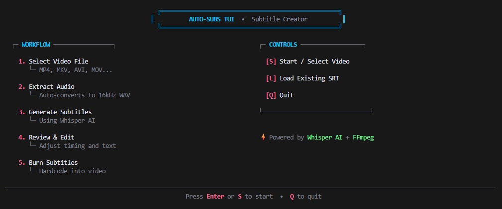
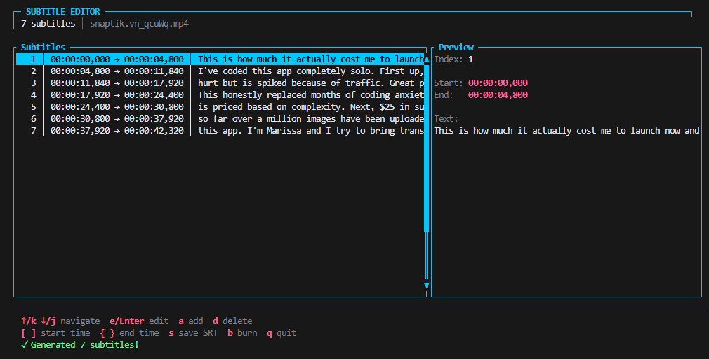

# Auto-Subs TUI

A powerful terminal-based application for creating and editing video subtitles, built in Rust. Now with comprehensive CLI support for integration with other tools and automation!



## Features

- **Extract Audio**: Automatically extract audio from video files (MP4, MKV, AVI, MOV, WebM, etc.)
- **Generate Subtitles**: Transcribe speech to text using OpenAI's Whisper model (runs locally)
- **Edit Subtitles**: Review and edit generated subtitles with a full-featured TUI editor
- **Burn Subtitles**: Hardcode subtitles into the video file
- **Advanced CLI**: FFmpeg-like command-line interface for automation and integration
- **Flexible Pipeline**: Run individual steps or complete workflows
- **Multiple Models**: Support for Whisper tiny, base, small, medium, and large models
- **Configurable**: TOML configuration file for default settings



## Requirements

- **Rust** (1.70+ recommended)
- **FFmpeg** installed and available in PATH
- ~500MB disk space for the Whisper model (downloaded automatically on first use)

### Installing FFmpeg

**Ubuntu/Debian:**
```bash
sudo apt update && sudo apt install ffmpeg
```

**Fedora:**
```bash
sudo dnf install ffmpeg
```

**macOS:**
```bash
brew install ffmpeg
```

**Arch Linux:**
```bash
sudo pacman -S ffmpeg
```

## Installation

```bash
# Clone the repository
git clone https://github.com/tmih06/auto-subs-tui.git
cd auto-subs-tui

# Build the application
cargo build --release

# Optional: Install to system
cargo install --path .
```

## Usage

### Quick Start

```bash
# Interactive TUI mode (no arguments)
auto-subs-tui

# Process a video (full pipeline: extract → transcribe → burn)
auto-subs-tui process video.mp4

# Process with custom model and language
auto-subs-tui process video.mp4 --model small --language fr

# Extract audio only
auto-subs-tui extract video.mp4 -o audio.wav

# Transcribe audio to subtitles
auto-subs-tui transcribe audio.wav -o subtitles.srt --model base

# Burn subtitles into video
auto-subs-tui burn video.mp4 subtitles.srt -o output.mp4
```

### CLI Commands

#### `process` - Full Pipeline
Process a video through the complete pipeline: extract audio, generate subtitles, and burn them into the video.

```bash
auto-subs-tui process [OPTIONS] <VIDEO>

Options:
  -m, --model <MODEL>          Whisper model [tiny|base|small|medium|large] (default: base)
  -l, --language <LANG>        Language code or 'auto' for detection (default: auto)
  -o, --output <FILE>          Output video path
  -k, --keep-files             Keep intermediate files (audio, SRT)
      --srt-output <FILE>      Custom SRT output path
      --audio-output <FILE>    Custom audio output path
      --translate              Translate to English
      --font-size <SIZE>       Subtitle font size (default: 24)
      --font-color <COLOR>     Font color in hex (default: FFFFFF)
      --outline-color <COLOR>  Outline color in hex (default: 000000)
      --style <STYLE>          Custom FFmpeg subtitle style

Examples:
  # Basic processing with default settings
  auto-subs-tui process video.mp4

  # Use small model with French language
  auto-subs-tui process video.mp4 -m small -l fr

  # Keep intermediate files and custom output
  auto-subs-tui process video.mp4 -k -o final_video.mp4

  # Custom subtitle styling
  auto-subs-tui process video.mp4 --font-size 28 --font-color FF00FF
```

#### `extract` - Audio Extraction
Extract audio from video files with custom format and quality settings.

```bash
auto-subs-tui extract [OPTIONS] <VIDEO>

Options:
  -o, --output <FILE>         Output audio file path
      --sample-rate <RATE>    Sample rate in Hz (default: 16000)
      --channels <N>          Audio channels (default: 1)
      --format <FMT>          Audio format [wav|mp3|flac] (default: wav)

Examples:
  # Extract with defaults (16kHz mono WAV)
  auto-subs-tui extract video.mp4

  # Extract to custom path
  auto-subs-tui extract video.mp4 -o /tmp/audio.wav

  # Extract stereo MP3 at 44.1kHz
  auto-subs-tui extract video.mp4 --format mp3 --sample-rate 44100 --channels 2
```

#### `transcribe` - Generate Subtitles
Transcribe audio files to SRT subtitles using Whisper.

```bash
auto-subs-tui transcribe [OPTIONS] <AUDIO>

Options:
  -m, --model <MODEL>      Whisper model [tiny|base|small|medium|large] (default: base)
  -l, --language <LANG>    Language code or 'auto' (default: auto)
  -o, --output <FILE>      Output SRT file path
      --translate          Translate to English
      --provider <NAME>    Transcription provider (default: whisper)

Examples:
  # Transcribe with default base model
  auto-subs-tui transcribe audio.wav

  # Use large model for better accuracy
  auto-subs-tui transcribe audio.wav -m large -o subs.srt

  # Transcribe Spanish and translate to English
  auto-subs-tui transcribe audio.wav -l es --translate
```

#### `burn` - Burn Subtitles
Hardcode subtitles into video with custom styling and encoding options.

```bash
auto-subs-tui burn [OPTIONS] <VIDEO> <SUBTITLES>

Options:
  -o, --output <FILE>          Output video path
      --font-size <SIZE>       Font size (default: 24)
      --font-color <COLOR>     Font color in hex (default: FFFFFF)
      --outline-color <COLOR>  Outline color in hex (default: 000000)
      --position <POS>         Position [top|middle|bottom] (default: bottom)
      --style <STYLE>          Custom FFmpeg style string
      --video-codec <CODEC>    Video codec (default: libx264, use 'copy' to preserve)
      --crf <VALUE>            Quality (18-28, lower=better) (default: 23)
      --preset <PRESET>        Encoding preset [ultrafast|fast|medium|slow|veryslow] (default: medium)

Examples:
  # Basic burning with defaults
  auto-subs-tui burn video.mp4 subtitles.srt

  # Custom output and styling
  auto-subs-tui burn video.mp4 subs.srt -o output.mp4 --font-size 28

  # Fast encoding with original video quality
  auto-subs-tui burn video.mp4 subs.srt --video-codec copy

  # High quality encoding
  auto-subs-tui burn video.mp4 subs.srt --crf 18 --preset slow

  # Position at top with custom colors
  auto-subs-tui burn video.mp4 subs.srt --position top --font-color FFFF00 --outline-color 000000
```

#### `edit` - TUI Editor
Launch the interactive TUI editor for an existing SRT file.

```bash
auto-subs-tui edit <SRT_FILE>

Examples:
  auto-subs-tui edit subtitles.srt
```

#### `config` - Configuration Management
Manage application configuration.

```bash
auto-subs-tui config [OPTIONS]

Options:
  --show  Show current configuration
  --init  Initialize default configuration file
  --path  Show configuration file path

Examples:
  # Create default config file
  auto-subs-tui config --init

  # View current configuration
  auto-subs-tui config --show

  # Find config file location
  auto-subs-tui config --path
```

### Configuration File

Auto-Subs TUI supports a TOML configuration file for setting default values. Initialize it with:

```bash
auto-subs-tui config --init
```

This creates `~/.config/auto-subs-tui/config.toml` (Linux/Mac) or `%APPDATA%\auto-subs-tui\config.toml` (Windows) with customizable defaults:

```toml
[whisper]
model = "base"
language = "en"
model_dir = "~/.cache/auto-subs-tui/models"

[audio]
sample_rate = 16000
channels = 1
format = "wav"

[subtitles]
format = "srt"
font_size = 24
font_color = "FFFFFF"
outline_color = "000000"
position = "bottom"

[video]
codec = "libx264"
crf = 23
preset = "medium"

[behavior]
keep_files = false
auto_overwrite = false
```

### Global Options

These options work with all commands:

```bash
-v, --verbose        Increase output verbosity (can be used multiple times: -vv)
-q, --quiet          Suppress non-error output
-y, --yes            Overwrite output files without asking
-n, --no-overwrite   Never overwrite output files
    --config <FILE>  Use custom configuration file
-h, --help           Show help information
-V, --version        Show version information
```

### Integration Examples

#### Bash Script for Batch Processing
```bash
#!/bin/bash
# Process all MP4 files in a directory

for video in *.mp4; do
  echo "Processing $video..."
  auto-subs-tui process "$video" -m base -l en -k
done
```

#### Python Integration
```python
import subprocess

def add_subtitles(video_path, model="base", language="auto"):
    result = subprocess.run([
        "auto-subs-tui", "process",
        video_path,
        "--model", model,
        "--language", language
    ], capture_output=True, text=True)
    
    if result.returncode == 0:
        print(f"Successfully processed {video_path}")
    else:
        print(f"Error: {result.stderr}")

add_subtitles("video.mp4", model="small", language="fr")
```

#### Makefile
```makefile
VIDEOS = $(wildcard *.mp4)
PROCESSED = $(VIDEOS:.mp4=_subtitled.mp4)

all: $(PROCESSED)

%_subtitled.mp4: %.mp4
	auto-subs-tui process $< -o $@ -m base -l auto

clean:
	rm -f *_subtitled.mp4 *.wav *.srt
```

### TUI Mode (Interactive)

Launch the interactive terminal UI by running without arguments:

```bash
auto-subs-tui
```

#### Workflow
1. Press `S` or `Enter` to browse for a video file
2. Wait for automatic audio extraction and transcription
3. Review and modify the generated subtitles in the editor
4. Press `B` to burn subtitles into the video

### Keyboard Shortcuts

#### Home Screen
| Key | Action |
|-----|--------|
| `S` / `Enter` | Start - Select video file |
| `L` | Load existing SRT file |
| `Q` | Quit |

#### File Browser
| Key | Action |
|-----|--------|
| `↑` / `k` | Move up |
| `↓` / `j` | Move down |
| `Enter` | Select file / Enter directory |
| `.` | Toggle hidden files |
| `Esc` | Go back |

#### Subtitle Editor
| Key | Action |
|-----|--------|
| `↑` / `k` | Previous subtitle |
| `↓` / `j` | Next subtitle |
| `e` / `Enter` | Edit selected subtitle |
| `a` | Add new subtitle |
| `d` | Delete selected subtitle |
| `[` / `]` | Adjust start time (-/+ 100ms) |
| `{` / `}` | Adjust end time (-/+ 100ms) |
| `s` | Save SRT file |
| `b` | Burn subtitles into video |
| `Esc` | Back to home |
| `q` | Quit |

#### Edit Mode
| Key | Action |
|-----|--------|
| Type | Edit text |
| `Enter` | Save changes |
| `Esc` | Cancel editing |

## Output Files

When you process a video, the following files are created:

- `video.wav` - Extracted audio (16kHz mono WAV)
- `video.srt` - Generated subtitles in SRT format
- `video_subtitled.mp4` - Video with burned-in subtitles

## Technology Stack

- **[Ratatui](https://ratatui.rs/)** - Terminal UI framework
- **[Crossterm](https://github.com/crossterm-rs/crossterm)** - Cross-platform terminal manipulation
- **[Whisper-rs](https://github.com/tazz4843/whisper-rs)** - Rust bindings for whisper.cpp
- **[FFmpeg](https://ffmpeg.org/)** - Audio extraction and subtitle burning
- **[Tokio](https://tokio.rs/)** - Async runtime

## License

MIT License
